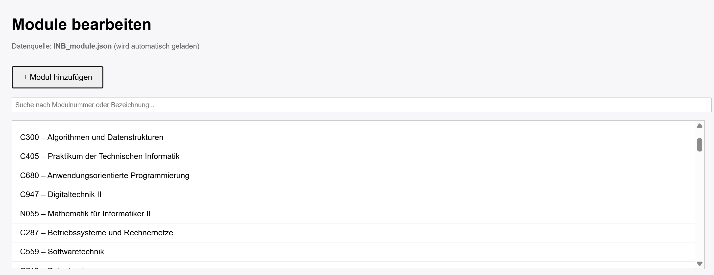
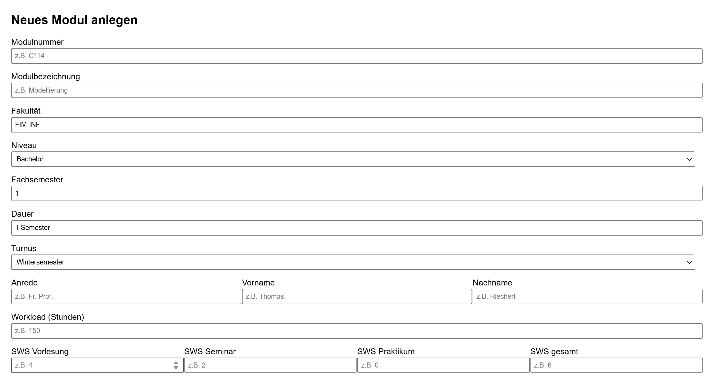
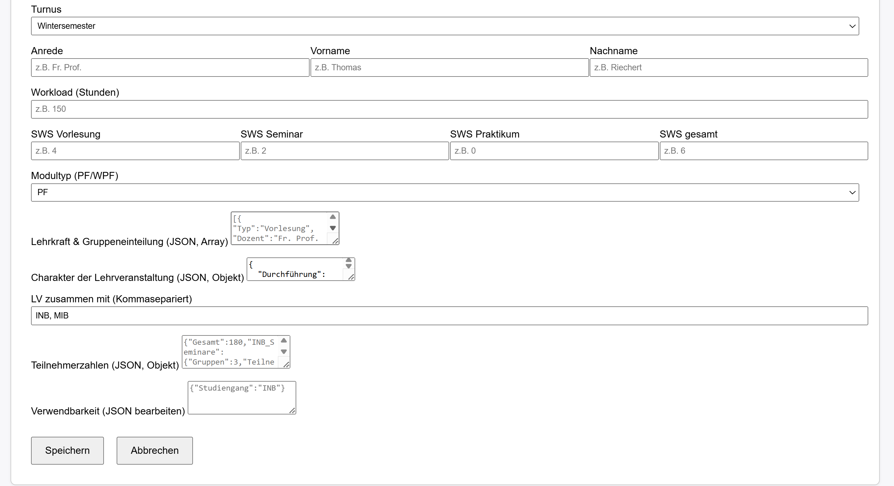
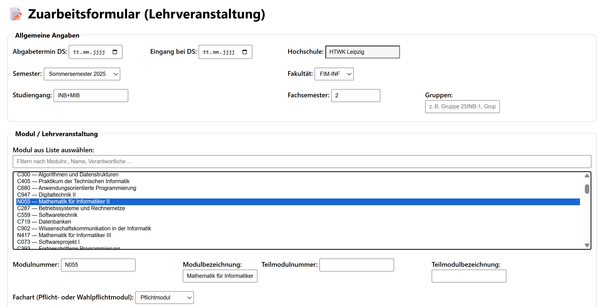
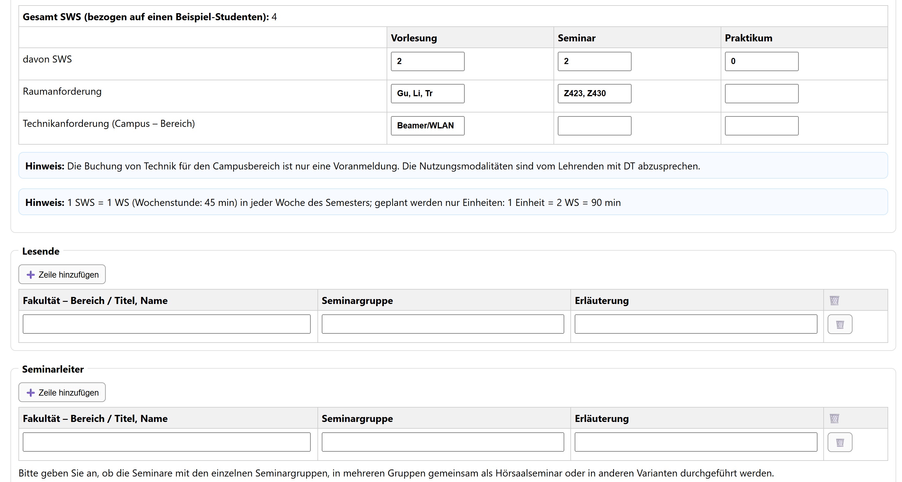
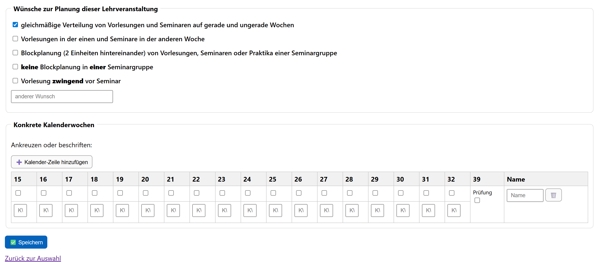
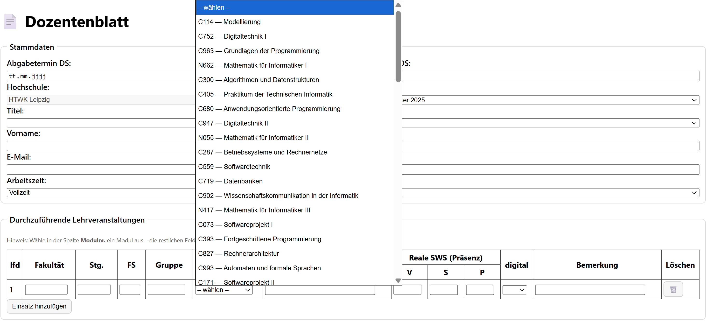
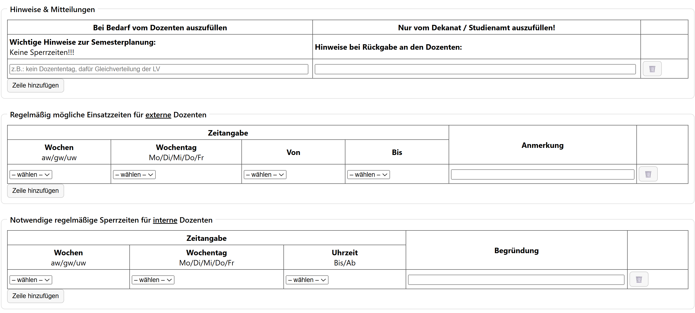
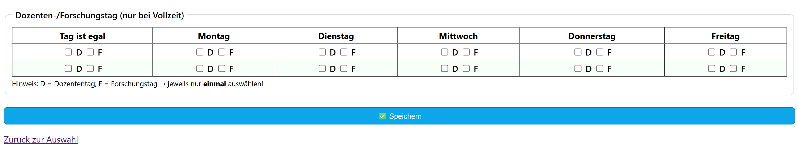

# RDF‑Formular – Entwicklungs-Prototyp

**Kurzüberblick**
- Drei Formulare: **Module**, **Zuarbeit**, **Dozenten**
- Zweck: automatische Formularbefüllung & Datenerfassung (Entwicklung / Tests für die Bachelorarbeit)
- Server läuft unter: `http://localhost:3000`

**Seiten**
- `/module/modulverwaltung.html` – Module verwalten (Infos einfügen/bearbeiten). Daten werden als **JSON** gespeichert und zur automatischen Formularbefüllung genutzt.
- `/zuarbeit/zuarbeitformular.html` – Zuarbeit; Modulauswahl füllt Felder vor. Speichert nach `rdf-formular/data/zuarbeitsblatt.ttl`.
- `/dozenten/dozentenformular.html` – analog Zuarbeit. Speichert nach `rdf-formular/data/dozentenblatt.ttl`.

## Screenshots

### Module




### Zuarbeit




### Dozenten




**Abhängigkeiten**
- Node.js
- `express`
- `body-parser` (falls verwendet)

---

## Installation & Start (am Ende)

### Lokal
```bash
npm install
node server.js
# Server: http://localhost:3000
```

### Container (Docker **oder** Podman)
**Dockerfile (minimal)**
```dockerfile
FROM node:latest
WORKDIR /usr/src/app
RUN npm init -y && npm install express body-parser
COPY . .
EXPOSE 3000
CMD ["node", "server.js"]
```

**Build & Run**
```bash
# Docker
docker build -t rdf-formular .
docker run --rm -p 3000:3000   -v "$PWD/rdf-formular/data:/usr/src/app/rdf-formular/data"   rdf-formular

# Podman
podman build -t rdf-formular .
podman run --rm -p 3000:3000   -v "$PWD/rdf-formular/data:/usr/src/app/rdf-formular/data"   rdf-formular
```
